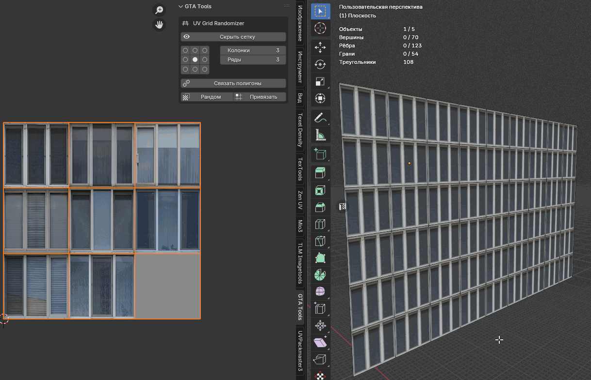
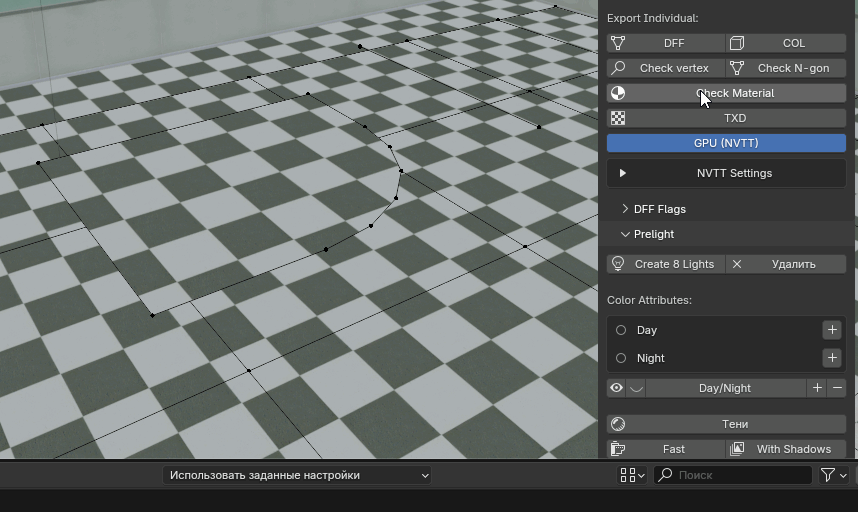

<div align="center">


# INU_Tools (GTA SA)

**Blender addon for GTA San Andreas modding — full pipeline from modeling to IMG archive.**

<p>
  
  
  
</p>
<p>
  
  <a href="../../issues"></a>
  <a href="../../stargazers"></a>
</p>

**[🇷🇺 Русская версия](docs/README_rus.md)** · **[📖 Documentation](docs/DOCS.md)** · **[⚖️ Compare to Kams / DragonFF](docs/COMPARISON.md)**

</div>

> [!IMPORTANT]
> **Two ways to install — pick based on your priority:**
>
> 🟢 **[Latest release](../../releases/latest)** — recommended for most users. Tested before publication, predictable behaviour.
>
> 🟡 **`main` branch** (this page's `Code → Download ZIP`, or `git clone`) — latest fixes and in-progress features that haven't shipped in a release yet. May contain bugs, unfinished work, or breaking changes. All `main` fixes eventually ship in the next release. If you hit a bug here, please mention **"from main"** in the issue so I can tell apart release vs. development reports.

---

## ✨ Highlights

<table>
<tr>
<td width="50%" valign="top">

- ⚡ **Performance** — Import Map ~10×, Export to IMG ~5–15× (parallel DFF parsing + batch IMG writer)
- 🎨 **Native parsers** — DFF / COL / TXD / IDE / IPL / IMG / IFP / FXP, zero external dependencies
- 🗺️ **Full map round-trip** — IMG → Blender → edit DFF + COL + TXD → IMG in another build
- 🎆 **effects.fxp editor** — 82 systems, live particle simulation in viewport
- 🦴 **Skinned DFF + IFP** — import peds with 294+ vanilla animations
- 🆔 **ID Manager** — multi-preset, scene sync, FLA range extension, conflict detection

</td>
<td width="50%" valign="top">


</td>
</tr>
</table>

## 🆕 What's new in 1.8.0

Release with **two parallel builds**, a new Validate Scene system, Modulate Color preview against `timecyc.dat`, and a pack of bug fixes from a deep Blender API audit. Extended Blender support down to **2.83 → 5.1** via `tools/compat.py`. Full backward-compatibility with .blend / .dff / .ipl / .ide from 1.7.x.

**Two builds, one source tree:**

- 🟢 **`inu_tools_gta_sa-1.8.0-full.zip`** — full edition, no restrictions. GPU NVTT compression (10–100× faster on large atlases), full multi-threaded import/export, every feature available. **Recommended for most users.** Install via `Edit → Preferences → Add-ons → Install from Disk`.
- 🟡 **`inu_tools_gta_sa-1.8.0.zip`** — store edition, also published through extensions.blender.org. No NVTT (CPU DXT), no `subprocess` outside a small allowlist, ToS-compliant data writes (per-user config dir). Slower runtime, but usable when you specifically need install via the official Blender extensions site. **Requires Blender 4.2+** (extension API floor).

**Highlights** — Validate Scene (single pre-export sweep) · Modulate Color preview (Day / Night `ambient_obj` from `timecyc.dat`) · Auto alpha-link after TXD import · DXT2 / DXT4 fourcc support (vanilla SA fence textures now decode correctly) · FLA IPL support (Fastman92 Limit Adjuster) · DFF auto-naming with `_DFF` suffix · DFF export ~2× faster on heavy meshes · Multi-mesh OBJS in IDE parser · IplOccl canonical field names · Blender 2.83 → 5.1 via `tools/compat.py`.

**Bug fixes** — DFF import NameError (`start = r.pos` restored) · unregister NameError (`_links_draw_handler`) · workspace_cycle console spam · enum cache flicker · IFP export jerky playback (`bl_quat.normalize()`) · IK rig on rest-pose peds · DFF / COL vertex limits with model name + count · `_save_paths` / `_load_paths` PropertyGroup migration (paths now persist across sessions) · 35+ leftover `scene.gtatools_*` references migrated to `scene.inu_settings.gtatools_*`.

**Internals** — PropertyGroup consolidation (`scene_settings.py`) · `bpy.utils.extension_path_user` for user data · 10 end-to-end tests inside headless Blender · static compliance guards (AST scan, manifest hygiene) · CI matrix builds + validates both store and full zips on every push.

→ **[Full release notes on GitHub](https://github.com/INU-ez/INU_Tools-GTA-sa-/releases/tag/v1.8.0)**

<details>
<summary>Older releases</summary>

- **v1.7.0** — IK Rig for SA peds (FK→IK bake, brute-force pole calibration, INU_Ground floor limiter), Animated Map Object workflow (one-click DFF+IFP+IDE for windmills/cranes), Frame Hierarchy Editor with vanilla VEHICLE/PED templates, Vehicle Paintjob support (Pay'n'Spray alt textures), Profile system (custom N-sidebar layouts), and a deep refactor: monolithic `__init__.py` (16k lines) split into 22 dedicated `ops/*.py` modules — [release page](https://github.com/INU-ez/INU_Tools-GTA-sa-/releases/tag/v1.7.0)

- **v1.6.7** — full Map Import → edit → Map Export round-trip preserving IDE / IPL / COL / TXD layout (CRLF, IPL inst dedup, ID consistency across `.NNN` duplicates), modal export with progress bar, `inu.col_name` + `inu.lod_object` properties, Group-by-IPL import + By-collection export split mode, main ↔ LOD pairing, per-`txd_name` TXD bucketing, per-DFF COL by default, modal ESC cancel, multi-collection picker, NVTT auto + parallel DXT1, dedicated Vehicles panel — [release page](https://github.com/INU-ez/INU_Tools-GTA-sa-/releases/tag/v1.6.7)
- **v1.6.6-beta** — partial pre-release with the initial 1.6.6 set: Map auto-split (XY grid), damage variants, train paths verified, COL ~5×, VC Layer System (BETA), IFP ANP2 / ANPK write, Bitmaps Manager unused cleanup. Superseded by v1.6.7 (which adds round-trip preservation, modal export, format-conformance fixes) — [release page](https://github.com/INU-ez/INU_Tools-GTA-sa-/releases/tag/v1.6.6-beta)
- **v1.6.5-beta** — map-workflow perf release: Import Map ~10× / Export to IMG ~5–15× faster, Load COL + Shared TXD toggles, Skip 2DFX default, ID Manager gaps & phantoms + multi-preset, UI pipeline reorganization (Stages 1-6) + Object Properties *INU Tools: Model* panel, Material Presets in `INU_Preset/`, progress bars (Build Map / Export to IMG / Extract Resources), opt-in Profiler — see [release page](https://github.com/INU-ez/INU_Tools-GTA-sa-/releases/tag/v1.6.5-beta)
- **v1.6.4** — Experimental: Map Export (scene→IPL+IDE+COL+TXD one-op), Binary IPL Write, CST IO, UV Animation in DFF, Breakable Objects, IFP Batch Import, GTA Material Panel, Bitmaps Manager, Station Markers, Roadblocks & Traffic Lights, FLA4 Path Format, Vehicle Scale Helper
- **v1.6.3** — Particle Effects (effects.fxp editor), Object Properties *GTA SA: IDE / IPL* panel, LightMap UV2, 2DFX UI (Detach All, attached effects list), ID Manager (Assign from ID…, Extend IDs FLA), Nodes multi-file I/O with 8×8 zone splitting
- **v1.6.1** — IPL Import: COL moves with DFF, Empty placeholders; Model Links dashed lines; LOD/COL → DFF snap; Drag & Drop TXD
- **v1.6.0** — Import Map full workflow, BBox Mode, IPL ZONE section, GPU NVTT auto-detect, Blender 4.2+
- **v1.5.3** — Skinned DFF + IFP animations, Water IO, Path IO, Blender 5.1 compatibility
- **v1.5.2** — Modular refactor (tools/ data/), COL Light Preview, Model ID Manager
- **v1.5.1** — IDE/IPL export/import, IMG Archive export, Dual Texture / Blend Mode
- **v1.5.0** — Native DFF/COL/TXD (no DragonFF), auto-import TXD, numpy DXT, package structure
- **v1.4.x** — UV Editor, Post-Processing VC, Fast Bake, DFF Flags, GPU TXD via NVTT, 50 material limit
- **v1.3.0** — Duplicate material cleanup
- **v1.2.x** — Export improvements (COL3, GTA SA version, progress bar)
- **v1.1.0** — DFF/COL/LOD/TXD export, suffix-based detection
- **v1.0.0** — Initial release

</details>

<details>
<summary><b>🔧 Compatibility</b></summary>

| | FULL build | STORE build |
|---|---|---|
| **Blender** | 2.83 – 5.1 (recommended 4.2+) | **4.2+ only** (extension API floor) |
| **GPU TXD compression** | NVIDIA Texture Tools (NVTT) supported | CPU encoder only |
| **Distribution** | Direct .zip from GitHub Release | extensions.blender.org / .zip from GitHub |

| | |
|---|---|
| **Game** | GTA San Andreas (also compatible with MTA:SA) |
| **OS** | Windows / Linux / macOS |
| **Optional** | NVIDIA GPU + NVIDIA Texture Tools (FULL build only) |

</details>

<details>
<summary><b>📦 Installation</b></summary>

**Pick one of the two builds** from the latest [GitHub Release](../../releases/latest):

**🟢 FULL — `inu_tools_gta_sa-X.Y.Z-full.zip`** (recommended)

1. Download the FULL zip from the release page
2. Open Blender → **Edit → Preferences → Add-ons** → ⌄ → **Install from Disk** → pick the zip
3. Enable **INU Tools (GTA SA)**

**🟡 STORE — `inu_tools_gta_sa-X.Y.Z.zip`** (Blender 4.2+ only)

Same edition that's published on extensions.blender.org. Two ways to install:

- Direct from the Blender extensions site: **Edit → Preferences → Get Extensions** → search "INU Tools" → Install
- Or download the STORE zip from the release: **Edit → Preferences → Get Extensions** → ⌄ → **Install from Disk**

</details>

<details>
<summary><b>🚀 Quick Start</b></summary>

Name your objects with suffixes, select them, and click **Export All**:

```
Building01_DFF   ← main mesh
Building01_LOD   ← low-poly LOD
Building01_COL   ← collision
```

The addon auto-assembles DFF + LOD + COL + TXD into one group and exports in a single click.

</details>

<details>
<summary><b>🧰 Features</b></summary>


<details>
<summary><b>&emsp;📤 Export / Import</b></summary>

| Feature | Detail |
|---|---|
| 📦 DFF export/import | GTA SA v3.6.0.3 |
| 📦 COL export/import | COL3 format |
| 📦 LOD export/import | automatic pairing with DFF |
| 📦 TXD export/import | DXT compression, parallel, GPU via NVTT |
| 🚀 Export All | batch by suffixes `_DFF` / `_LOD` / `_COL` + auto TXD |
| 🗂️ Collection export | exports active collection if nothing selected |
| 🎨 Drag & Drop TXD | drop `.txd` into viewport with auto material creation |
| 🎨 DFF Flags panel | Normals, Light, Modulate Color, UV1/UV2, Day/Night, BinMesh |

</details>

<details>
<summary><b>&emsp;🗺️ IDE / IPL / IMG</b></summary>

| Feature | Detail |
|---|---|
| 📦 IDE export/import | all sections (objs, tobj, anim, cars, peds, weap, hier, txdp), upsert/remove, auto-LOD |
| 📦 IPL export/import | all sections (inst, cull, grge, enex, pick, cars, auzo, jump, occl, tcyc, zone) + binary IPL (bnry) |
| 🎨 IPL Sections visualization | cull, garage, enex, pickup, cars, auzo, jump, occl, zone as Blender objects |
| 📦 IMG Archive | export/import DFF + LOD + TXD + COL into `.img` (VER2) |
| 🗺️ Import Map | extract from IMG, build `.glb`, auto-sort into collections |
| ⚡ BBox Mode | distant objects → Bounding Box, full models within 300m of selection |
| 🗺️ Map regions | auto-detected from `gta.dat` (LA, SF, VEGAS, COUNTRY…) |
| 🆔 Model ID Manager | file (321–19999), sync scene, load from game, search + pagination |
| 🆔 Assign IDs from number | 🆕 skip occupied IDs, start from any number |
| 🆔 Extend IDs (FLA) | 🆕 extend range for Fastman Limit Adjuster |
| 🎨 IDE Flags | 15 checkboxes (IS_ROAD, IS_TREE, DRAW_LAST…) |
| ⚙️ Custom suffixes/prefixes | `_DFF`, `_LOD`, `_COL`, `LOD`, etc. |
| 🔗 Model Links | dashed-line visualization DFF↔LOD↔COL |
| 🗑️ Remove from IMG | delete DFF/COL/TXD by selected object type |
| 🔍 IMG File List | scrollable UIList with search |
| 🔄 Replace Empty | replace IPL placeholders with scene models |
| 🗺️ X Radar Maker | minimap tiles (8×8, menu, full radar) + pack to TXD |

</details>

<details>
<summary><b>&emsp;💡 Prelight</b></summary>

| Feature | Detail |
|---|---|
| 💡 Vertex Colors baking | Fast / With Shadows |
| 💡 Raycast shadows | via depsgraph |
| 🎨 Fill Colors | polygon painting with eyedropper + level system |
| 💡 Scatter Light | configurable light scattering |
| 🌓 Day/Night | separate color attributes |
| 💡 LightMap UV2 | 🆕 Add/Toggle/Remove buttons, Multiply blend |
| 🔍 Vertex color analysis | and preview |
| 💡 Prelight COL | vertex colors → COL Day/Night Light |
| 🎨 COL Light Preview | Edge / Threshold / Contrast settings |
| ⚙️ Prelight Presets | save/load bake settings |

<details>
<summary>📹 Tutorial .gif</summary>


</details>

</details>

<details>
<summary><b>&emsp;🎨 Post-Processing</b></summary>

| Feature | Detail |
|---|---|
| 🎨 Smooth | smooth vertex colors between neighboring vertices |
| 🎨 Smooth Between Objects | smooth VC at seams between different objects |
| 🎨 Contrast | contrast adjustment |
| 🎨 Brightness | brightness adjustment |
| 🎨 Gamma | gamma correction |

</details>

<details>
<summary><b>&emsp;🎯 2DFX Effects</b></summary>

| Feature | Detail |
|---|---|
| 🎆 Create effects | Light, Particle, Ped Attractor, Sun Glare |
| 🔗 Attach/Detach to mesh | coordinates auto-recalculated on export |
| 🔗 Detach All from Mesh | 🆕 batch detach all 2DFX from selected mesh |
| 🎨 Attached 2DFX list | 🆕 in mesh UI with per-item detach buttons |
| ⚙️ Presets | Default, OnAllDay, Lamp Post, BB Pickup, Flashing, Train Crossing, Traffic |
| 🎨 Texture dropdowns | 34 Corona textures, Shadow, Show Mode, Flare Type |
| 📦 2DFX export | RW Light chunk + 2DFX PLG |
| 🎨 Real-time visualization | and editing of all effects |

<details>
<summary>📹 Tutorial .gif</summary>


</details>

</details>

<details>
<summary><b>&emsp;🎆 Particle Effects (<code>effects.fxp</code>)</b></summary>

> 🆕 **Fully new in 1.6.3** — edit GTA SA particles directly in Blender.

| Feature | Detail |
|---|---|
| 📦 Full parser | text-based `effects.fxp`, 82 effects |
| ⚡ Viewport simulation | 30 FPS, up to 64 particles per emitter |
| 🎨 Effect dropdown | pick from all systems in `effects.fxp` |
| 🎨 Multi-emitter switching | browse emitters within a single system |
| ⚙️ 40+ parameters | color (start/mid/end), size, speed, direction, physics |
| 💨 Emission | rate, life, speed, direction, angle, volume box, offset |
| 🌍 Physics | gravity, friction, wind, noise, jitter, ground bounce |
| 📈 Keyframe editor | curves for size/color/alpha over lifetime |
| 💾 Save back | to `effects.fxp` with auto-backup (`.fxp.bak`) |
| ⚙️ Operators | New / Delete / Switch Emitter / Reload |
| 🎨 Camera-facing billboards | same as Light corona |

</details>

<details>
<summary><b>&emsp;🎨 Materials</b></summary>

| Feature | Detail |
|---|---|
| 🎨 Environment Map | |
| 🎨 Bump Map | |
| 🎨 Specular | |
| 🎨 UV Animation | |
| 🎨 Reflection Material | |
| 🎨 Dual Texture / Blend Mode | |
| 📦 COL Surface Type | 179 GTA SA types |
| ⚡ Auto-load textures | by material names |
| 🎨 Drag & Drop | create materials from images |
| 🧹 Duplicate cleanup | removes `.001`, `.002` |
| 🔤 Sort materials | by name |

</details>

<details>
<summary><b>&emsp;🧮 UV Editor</b></summary>

| Feature | Detail |
|---|---|
| 🎲 UV Grid Randomizer | randomize UV positions within grid cells |
| 🎯 Snap to Grid | snap UV islands to nearest cell |
| 📐 9 alignment points | choose UV position within a cell |
| 🔗 Link Polygons | move polygons with overlapping UVs together |

<details>
<summary>📹 Tutorial .gif</summary>



</details>

</details>

<details>
<summary><b>&emsp;🔍 Check</b></summary>

| Feature | Detail |
|---|---|
| 🔍 Geometry check | loose vertices, edges, N-gons |
| ⚠️ Material limit check | 50 materials for GTA SA |
| 🧹 Material cleanup/sorting | |
| 🎯 LOD/COL → DFF snap | move LOD and COL to DFF position |
| 👁️ Hide DFF/LOD/COL | separately |
| ⚠️ Model ID conflict detection | |
| 🔄 Batch Set Type | 🆕 OBJ / COL / SHA / NON with auto-rename |
| 🔄 Reset Transform | 🆕 zero out Location and Rotation |

<details>
<summary>📹 Tutorial .gif</summary>



</details>

</details>

<details>
<summary><b>&emsp;🌊 Water IO</b></summary>

| Feature | Detail |
|---|---|
| 📦 Import/export | `water.dat` |
| 🌊 waterclear256 texture | with flow animation |
| 🌊 Water types | Default / Shallow, Visible / Invisible |
| 🎯 Snap to grid (×4) | stitch edges |
| 📦 Export Water collection | |

</details>

<details>
<summary><b>&emsp;🛣️ Path IO</b></summary>

| Feature | Detail |
|---|---|
| 📦 paths.ipl | vehicle/ped paths for `gta.dat` |
| 📦 tracks.dat | train tracks and stations |
| 📦 NODES.dat | compiled path nodes, multi-file import 🆕 |
| 🛣️ Create paths | convert curves/edges to paths |
| ⚙️ Auto-split | 12-node groups |
| 🗺️ NODES export | auto-split by 8×8 map zones 🆕 |

</details>

<details>
<summary><b>&emsp;🦴 Characters (Skinned DFF)</b></summary>

| Feature | Detail |
|---|---|
| 🦴 Import skeleton | Armature + vertex weights + bone matrices |
| 📦 Export skinned DFF | byte-perfect round-trip |
| 🎬 IFP animations | import `ped.ifp` (294+ anims), search, apply |
| ✅ Compatible | Kams Script DFF and original game models |

</details>

<details>
<summary><b>&emsp;🔌 Integrations</b></summary>

| Integration | Purpose |
|---|---|
| [Itera Tools 3](https://itera.gumroad.com/l/IteraTools3) | Vertex Lit Linear / Quickstart |
| LightMap (beta_MTA) | apply pre-baked lightmap via MTA script |
| Pipeline | Building / Reflections |
| Hotkeys | `Shift+T`, `Shift+A` |
| Localization | RU / EN |

</details>

</details>

<details>
<summary><b>🧭 UI Panels</b></summary>

| Location | Panel | What's there |
|---|---|---|
| `Properties > Scene` | **INU Tools** | IDE/IPL/IMG paths, textures, NVTT, suffixes, ID manager, presets |
| `Properties > Object` | **GTA SA Object** | object type (OBJ/COL/SHA/2DFX), DFF Flags, Pipeline, UV Maps |
| `Properties > Object` | **GTA SA: IDE / IPL** 🆕 | Model ID, Draw Dist, LOD Dist, IDE Flags, Interior, conflicts |
| `Properties > Material` | **GTA SA Material Effects** | Environment Map, Bump Map, Reflection, Specular, UV Animation |
| `Properties > Material` | **COL Surface Type** | collision surface type selection |
| `View3D > Sidebar (N)` | **GTA Tools** | export/import, prelight, 2DFX, particles, vertex paint |
| `UV Editor > Sidebar (N)` | **GTA Tools** | UV tools |

</details>

<details>
<summary><b>⌨️ Hotkeys</b></summary>

| Key | Action |
|---|---|
| `Shift+T` | Open / close UV Editor |
| `Shift+A` | GTA SA → Army.dff (ped) / Admiral.dff (car) |

</details>

<details>
<summary><b>📹 Video Tutorial</b></summary>

[](https://www.youtube.com/watch?v=Jw_R9QFYxWE)

> Export & Import IDE / IPL / IMG / Map

</details>

## 🙏 Credits

Inspired by and partially compatible with:

- **[DragonFF](https://github.com/Parik27/DragonFF)** (Parik, GPL-3.0) — Blender addon for RenderWare formats. INU_tools uses compatible material and object property names for easy transition between addons.
- **[RenderWare](https://en.wikipedia.org/wiki/RenderWare)** — GTA SA game engine, DFF/COL/TXD format documentation.

### 🔧 Recommended companion tools

- **[Itera Tools 3](https://itera.gumroad.com/l/IteraTools3)** — Blender addon for vertex lighting. INU_tools includes a dedicated **Itera Tools 3** sub-panel (under the *Lighting* container) that auto-detects Itera in your Asset Libraries and applies its `Vertex Lit Linear` / `Quickstart` material presets to the selection (with one-click `Remove Itera` to restore original materials).
- **[NVIDIA Texture Tools](https://developer.nvidia.com/texture-tools-exporter)** — standalone CLI/GUI for GPU-accelerated DXT compression. Optional but recommended: when installed and pointed at via `Scene → INU Tools → NVTT Path`, TXD export uses GPU encoding (parallel DXT1, much faster than the bundled CPU encoder).

### Author

**INU** — addon author (Discord: `1.n.u`)
https://discord.gg/sqtGAVTGdy

### License

[GPL-3.0](LICENSE)
