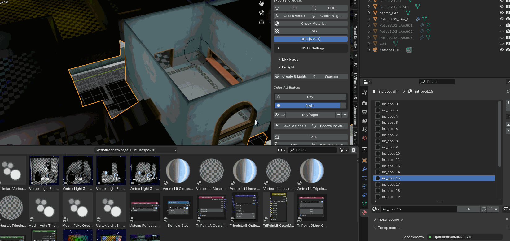
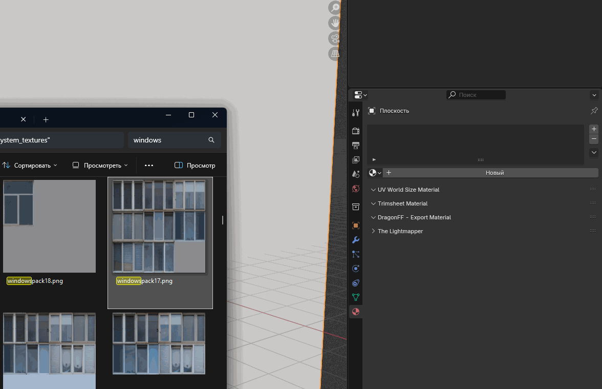
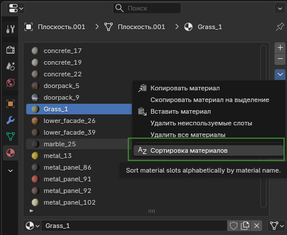

# INU_Tools (GTA SA)

> **[Русская версия / Russian version](README.md)**

INU_Tools is a Blender addon for working with GTA San Andreas models.
It provides tools for export, prelighting, and 3D model preparation.
Starting from v1.5.0, the addon has its own DFF, COL, and TXD export (no DragonFF dependency).

## Features

<b>Export/Import</b>

> - DFF export/import (GTA SA v3.6.0.3)
> - COL export/import (COL3 format)
> - LOD export/import
> - TXD export/import (DXT compression, parallel processing, GPU via NVIDIA Texture Tools)
> - Export All — batch export by suffixes `_DFF` / `_LOD` / `_COL` + automatic TXD assembly

<b>Support Itera Tools 3</b>

> - Save materials on model for Itera
>
> 

> 
<b>Tutorial .gif</b>

>
> 
>
> 

<b>Prelight</b>

> - Vertex Colors baking (Fast / With Shadows)
> - Raycast shadows via depsgraph
> - Fill Colors — polygon painting with eyedropper and level system
> - Scatter Light — light scattering with configurable parameters
> - Day/Night — separate color attributes for day and night
> - Vertex color analysis and preview
> - Prelight COL — convert vertex colors to COL Day/Night Light (auto-split materials by brightness)
>
> 

> 
<b>Tutorial .gif</b>

>
> 
>
> 

<b>2DFX Effects</b>

> - Create 2DFX effects (Light, Particle, Ped Attractor, Sun Glare)
> - Attach/Detach 2DFX to mesh — coordinates are automatically recalculated relative to the mesh on export
> - Presets: Default, OnAllDay, Lamp Post, Lamp Post Coast, BB Pickup, Flashing variants, Train Crossing, Traffic
> - Dropdowns for Corona Texture (34 textures), Shadow Texture, Show Mode, Flare Type
> - Show Mode — display modes (Default, Random Flashing, Flash Rain, Only Rain, No Rain, Flash 5)
> - 2DFX export to DFF (RW Light chunk + 2DFX PLG) — compatible with MTA SA / GTA SA
> - Real-time visualization and editing of all effects
>
> 

> 
<b>Tutorial .gif</b>

>
> 
>
> 

<b>Post-Processing</b>

> - Smooth — smooth vertex colors between neighboring vertices
> - Contrast — contrast adjustment
> - Brightness — brightness adjustment
> - Gamma — gamma correction

<b>UV Editor</b>

> - UV Grid Randomizer — randomize UV positions within grid cells
> - Snap to Grid — snap UV islands to the nearest cell
> - 9 alignment points — choose UV position within a cell
> - Link Polygons — move polygons with overlapping UVs together
>
> 

> 
<b>Tutorial .gif</b>

>
> 
>
> 

<b>Geometry & Materials</b>

> - Geometry check — loose vertices, edges, N-gons
> - Geometry cleanup — remove problematic elements
> - Material limit check (50 for GTA SA)
>
> 

> 
<b>Tutorial .gif</b>

>
> 
>
> 

> - Auto-load textures by material names
> - Drag & Drop — create materials by dragging images
>
> 

> 
<b>Tutorial .gif</b>

>
> 
>
> 

> - Clean up duplicate materials (.001, .002)
> - Sort materials by name
>
> 

> 
<b>Tutorial</b>

>
> 
>
> 

<b>Lightmap Generator</b>

> - MTA script code generation
> - Copy lightmap settings between objects
> - V-offset adjustment for texture alignment

The MTA script file link is available in Issues.

## Installation

1. Download the `INU_tools/` folder (or zip archive)
2. Place `INU_tools/` into `Blender/5.1/scripts/addons/`
3. Blender → Edit → Preferences → Add-ons → enable "INU_tools(gta_sa)"

## Usage

The addon adds panels to:
- **Properties > Scene > INU Tools** — textures, NVTT settings
- **Properties > Object > GTA SA Object** — object type (OBJ/COL/SHA/2DFX), DFF Flags, Pipeline, UV Maps
- **Properties > Material > GTA SA Material Effects** — Environment Map, Bump Map, Reflection, Specular, UV Animation
- **Properties > Material > COL Surface Type** — collision surface type selection
- **View3D > Sidebar (N) > GTA Tools** — export/import, prelight, 2DFX, vertex paint
- **UV Editor > Sidebar (N) > GTA Tools** — UV tools

<b>Hotkeys</b>

> | Key | Action |
> |-----|--------|
> | `Shift+T` | Open / close UV Editor |
> | `Shift+A` | GTA SA → Army.dff (ped) / Admiral.dff (car) |

#### Quick Export

Name objects with suffixes (`Model_DFF`, `Model_LOD`, `Model_COL`), select them, and click **Export All**.

## Requirements

- **Blender 5.1+**
- NVIDIA Texture Tools — optional, for GPU texture compression
- Itera Tools 3 - (https://itera.gumroad.com/l/IteraTools3)

<b>Changelog</b>

- **v1.5.0** — Native DFF/COL/TXD import and export (no DragonFF); auto-import TXD when importing DFF; numpy DXT decompression; material sorting by name; addon converted to package structure (`INU_tools/`); fixed prelight preview on export; Blender 5.1 compatibility
- **v1.4.8** — Shift+T to toggle UV Editor
- **v1.4.7** — COL Surface Type with 13 category groups; Day/Night Light + Brightness in Material Properties; Prelight COL — convert vertex colors to COL Light with auto-split materials by brightness (0-15)
- **v1.4.6** — Post-Processing vertex colors (Smooth, Contrast, Brightness, Gamma); Fast Bake with shadows (raycast); DFF Flags panel
- **v1.4.5** — Export All: batch export of multiple groups; Lightmap Generator returned to UI
- **v1.4.4** — Fill Colors, Scatter Light, Drag-and-Drop textures, panel moved to Properties > Scene
- **v1.4.3** — Fixed DXT3 transparency; skip textures not divisible by 4
- **v1.4.2** — GPU TXD mode via NVIDIA Texture Tools
- **v1.4.1** — Parallel TXD processing (up to 8x faster)
- **v1.4.0** — UV Editor panel, Snap to Grid, polygon linking, 50 material limit
- **v1.3.0** — Duplicate material cleanup
- **v1.2.x** — Export improvements series (COL3, GTA SA version, progress bar, auto-Collision Object)
- **v1.1.0** — DFF/COL/LOD/TXD export, suffix-based detection
- **v1.0.0** — Initial release

## Credits

Inspired by and partially compatible with:

- **[DragonFF](https://github.com/Parik27/DragonFF)** (Parik, GPL-3.0) — Blender addon for RenderWare formats. INU_tools uses compatible material and object property names for easy transition between addons.
- **[RenderWare](https://en.wikipedia.org/wiki/RenderWare)** — GTA SA game engine, DFF/COL/TXD format documentation.

#### Author

- **INU** — addon author (Discord: 1.n.u)

#### License

[GPL-3.0](LICENSE)
