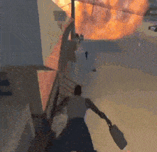

<div align="center">


# INU_Tools (GTA SA)

**Blender-аддон для моддинга GTA San Andreas — полный пайплайн от моделинга до IMG-архива.**

<p>
  
  
  
</p>
<p>
  
  <a href="../../issues"></a>
  <a href="../../stargazers"></a>
</p>

**[🇬🇧 English version](README.md)** · **[📖 Документация](DOCS_rus.md)** · **[⚖️ Сравнение с другими инструментами](COMPARISON.md)**

</div>

---

## ✨ Главное

<table>
<tr>
<td width="50%" valign="top">

- ⚡ **Производительность** — Import Map ~10×, Export to IMG ~5–15× (параллельный парсинг DFF + batch IMG writer)
- 🎨 **Нативные парсеры** — DFF / COL / TXD / IDE / IPL / IMG / IFP / FXP, без внешних зависимостей
- 🗺️ **Полный round-trip карты** — IMG → Blender → правка DFF + COL + TXD → IMG другой сборки
- 🎆 **Редактор `effects.fxp`** — 82 системы, живая симуляция частиц во viewport
- 🦴 **Skinned DFF + IFP** — импорт педов с 294+ ванильными анимациями
- 🆔 **ID Manager** — multi-preset, sync со сценой, FLA-расширение, детекция конфликтов

</td>
<td width="50%" valign="top">



</td>
</tr>
</table>

## 🔮 Planned / In Progress

**Машины**
- 🛡️ **Damage variants UI расширение** — визуальная связь между парными `_ok` / `_dam` атомиками, кастомный pivot для качающихся дверей, батч-инструменты расстановки `dummy` для фар

**Map workflow**
- 📐 **Adaptive grid auto-split** — переменный размер ячейки от локальной плотности (сейчас только фиксированная XY-сетка); гарантия числа DFF на ячейку вместо равномерного пространственного разбиения

**Анимации**
- 🎬 **IFP merge / round-trip preview** — валидатор конверсии ANPK ↔ ANP3, превью клипа без переимпорта

> [!NOTE]
> Аддон в активной разработке. Сообщения об ошибках приветствуются в [Issues](../../issues).

## 🆕 Что нового в 1.6.7

Первый стабильный релиз после [v1.6.6-beta](https://github.com/INU-ez/INU_Tools-GTA-sa-/releases/tag/v1.6.6-beta). Добавляет полный round-trip Map Import → правка → Map Export с сохранением IDE / IPL / COL / TXD-лейаута точно как в ванильной SA, модальный экспорт с progress-bar'ом, и пакет format-conformance фиксов (CRLF line endings, IPL inst dedup, согласованность ID для `.NNN` дубликатов).

**Главное** — round-trip preservation через `inu.col_name` + `inu.lod_object` свойства · Group by IPL импорт + By-collection экспорт-режим · парность main ↔ LOD в IDE/IPL · TXD-баккетинг по `txd_name` · per-DFF COL по умолчанию · модальный экспорт с ESC cancel · multi-collection чекбоксный picker · NVTT auto + параллельный DXT1 · отдельная Vehicles панель.

→ **[Полные release notes на GitHub](https://github.com/INU-ez/INU_Tools-GTA-sa-/releases/tag/v1.6.7)**

<details>
<summary>Более старые релизы</summary>

- **v1.6.6-beta** — частичный pre-release с первым набором 1.6.6: Map auto-split (XY-сетка), damage variants, train paths verified, COL ~5×, VC Layer System (BETA), IFP ANP2 / ANPK write, Bitmaps Manager unused cleanup. Заменён на v1.6.7 (round-trip preservation, modal export, format-conformance фиксы) — [страница релиза](https://github.com/INU-ez/INU_Tools-GTA-sa-/releases/tag/v1.6.6-beta)
- **v1.6.5-beta** — релиз о производительности map-workflow: Import Map ~10× / Export to IMG ~5–15× быстрее, тумблеры Load COL + Shared TXD, Skip 2DFX по умолчанию, ID Manager дыры/фантомы + multi-preset, UI pipeline реорганизация (Этапы 1-6) + панель *INU Tools: Model* в Object Properties, Material Presets в `INU_Preset/`, прогресс-бары (Build Map / Export to IMG / Extract Resources), опциональный Профайлер — см. [страницу релиза](https://github.com/INU-ez/INU_Tools-GTA-sa-/releases/tag/v1.6.5-beta)
- **v1.6.4** — Experimental: Map Export (сцена→IPL+IDE+COL+TXD одной кнопкой), Binary IPL Write, CST IO, UV-анимация в DFF, Breakable Objects, IFP Batch Import, GTA Material Panel, Bitmaps Manager, Station Markers, Roadblocks & Traffic Lights, FLA4 Path Format, Vehicle Scale Helper
- **v1.6.3** — Particle Effects (редактор effects.fxp), Object Properties *GTA SA: IDE / IPL* панель, LightMap UV2, 2DFX UI (Detach All, список эффектов), ID Manager (Assign from ID…, Extend IDs FLA), Nodes multi-file I/O с разбивкой на 8×8 зон
- **v1.6.1** — IPL Import: COL движется с DFF, Empty-плейсхолдеры; Model Links пунктирные линии; LOD/COL → DFF snap; Drag & Drop TXD
- **v1.6.0** — Import Map полный workflow, BBox Mode, секция IPL ZONE, GPU NVTT авто-определение, Blender 4.2+
- **v1.5.3** — Skinned DFF + IFP анимации, Water IO, Path IO, совместимость с Blender 5.1
- **v1.5.2** — Модульный рефакторинг (tools/ data/), COL Light Preview, Model ID Manager
- **v1.5.1** — IDE/IPL экспорт/импорт, IMG Archive экспорт, Dual Texture / Blend Mode
- **v1.5.0** — Нативные DFF/COL/TXD (без DragonFF), авто-импорт TXD, numpy DXT, package-структура
- **v1.4.x** — UV Editor, Post-Processing VC, Fast Bake, DFF Flags, GPU TXD через NVTT, лимит 50 материалов
- **v1.3.0** — Очистка дубликатов материалов
- **v1.2.x** — Улучшения экспорта (COL3, версия GTA SA, прогресс-бар)
- **v1.1.0** — DFF/COL/LOD/TXD экспорт, суффиксы
- **v1.0.0** — Первый релиз

</details>

<details>
<summary><b>🔧 Совместимость</b></summary>

| | |
|---|---|
| **Blender** | 4.2 – 5.1 ✅ |
| **Игра** | GTA San Andreas (совместим с MTA:SA) |
| **ОС** | Windows / Linux / macOS |
| **Опционально** | NVIDIA GPU (для NVTT-сжатия текстур) |

</details>

<details>
<summary><b>📦 Установка</b></summary>

1. Скачай папку `INU_tools/` (или zip-архив)
2. Скопируй её в директорию аддонов Blender:
   ```
   Blender/<version>/scripts/addons/INU_tools/
   ```
3. Открой Blender → **Edit → Preferences → Add-ons** → включи **INU_tools(gta_sa)**

</details>

<details>
<summary><b>🚀 Быстрый старт</b></summary>

Назови объекты с суффиксами, выдели их и нажми **Export All**:

```
Building01_DFF   ← основной меш
Building01_LOD   ← low-poly LOD
Building01_COL   ← коллизия
```

Аддон автоматически соберёт DFF + LOD + COL + TXD в одну группу и экспортирует в один клик.

</details>

<details>
<summary><b>🧰 Возможности</b></summary>

Обозначения: 🆕 новое в 1.6.3 · ⚡ производительность · 🎨 UI · 📦 поддержка формата

<details>
<summary><b>📤 Экспорт / Импорт</b></summary>

| Фича | Детали |
|---|---|
| 📦 DFF экспорт/импорт | GTA SA v3.6.0.3 |
| 📦 COL экспорт/импорт | формат COL3 |
| 📦 LOD экспорт/импорт | автоматическая привязка к DFF |
| 📦 TXD экспорт/импорт | DXT-сжатие, параллельно, GPU через NVTT |
| 🚀 Export All | массовый экспорт по суффиксам `_DFF` / `_LOD` / `_COL` + авто TXD |
| 🗂️ Экспорт коллекций | активная коллекция, если ничего не выделено |
| 🎨 Drag & Drop TXD | перетащить `.txd` во viewport — материалы создаются сами |
| 🎨 DFF Flags | панель флагов: Normals, Light, Modulate Color, UV1/UV2, Day/Night, BinMesh |

</details>

<details>
<summary><b>🗺️ IDE / IPL / IMG</b></summary>

| Фича | Детали |
|---|---|
| 📦 IDE экспорт/импорт | все секции (objs, tobj, anim, cars, peds, weap, hier, txdp), upsert/remove, авто-LOD |
| 📦 IPL экспорт/импорт | все секции (inst, cull, grge, enex, pick, cars, auzo, jump, occl, tcyc, zone) + бинарный IPL (bnry) |
| 🎨 IPL Sections визуализация | cull, garage, enex, pickup, cars, auzo, jump, occl, zone как объекты в Blender |
| 📦 IMG Archive | экспорт/импорт DFF + LOD + TXD + COL в `.img` (VER2) |
| 🗺️ Import Map | извлечение из IMG, сборка `.glb`, авто-сортировка по коллекциям |
| ⚡ BBox Mode | далёкие объекты → Bounding Box, полные модели в радиусе 300м от выделения |
| 🗺️ Регионы карты | автоопределение из `gta.dat` (LA, SF, VEGAS, COUNTRY…) |
| 🆔 Менеджер ID | файл (321–19999), синхронизация сцены, загрузка из игры, поиск + прокрутка |
| 🆔 Назначить ID с номера | 🆕 пропуск занятых ID, старт с любого номера |
| 🆔 Расширить ID (FLA) | 🆕 расширение диапазона для Fastman Limit Adjuster |
| 🎨 IDE Флаги | 15 чекбоксов (IS_ROAD, IS_TREE, DRAW_LAST…) |
| ⚙️ Суффиксы/префиксы | `_DFF`, `_LOD`, `_COL`, `LOD` и т.д. |
| 🔗 Model Links | визуализация связей DFF↔LOD↔COL пунктиром |
| 🗑️ Remove from IMG | удаление DFF/COL/TXD по типу выделенного объекта |
| 🔍 IMG File List | прокручиваемый UIList с поиском |
| 🔄 Replace Empty | замена IPL-плейсхолдеров моделями сцены |
| 🗺️ X Radar Maker | тайлы миникарты (8×8, меню, полный радар) + упаковка в TXD |

</details>

<details>
<summary><b>💡 Prelight</b></summary>

| Фича | Детали |
|---|---|
| 💡 Vertex Colors бейк | Fast / With Shadows |
| 💡 Raycast-тени | через depsgraph |
| 🎨 Fill Colors | покраска полигонов с пипеткой + уровневая система |
| 💡 Scatter Light | рассеивание света с настройками |
| 🌓 День/Ночь | раздельные color-атрибуты |
| 💡 LightMap UV2 | 🆕 кнопки Add/Toggle/Remove, Multiply blend |
| 🔍 Анализ vertex colors | и превью |
| 💡 Prelight COL | vertex colors → COL Day/Night Light |
| 🎨 COL Light Preview | настройки Edge / Threshold / Contrast |
| ⚙️ Prelight Presets | сохранение/загрузка настроек |

<details>
<summary>📹 .gif-туториал</summary>


</details>

</details>

<details>
<summary><b>🎨 Post-Processing</b></summary>

| Фича | Детали |
|---|---|
| 🎨 Smooth | сглаживание vertex colors между соседними вершинами |
| 🎨 Smooth Between Objects | сглаживание VC на стыках между разными объектами |
| 🎨 Contrast | настройка контраста |
| 🎨 Brightness | настройка яркости |
| 🎨 Gamma | гамма-коррекция |

</details>

<details>
<summary><b>🎯 2DFX эффекты</b></summary>

| Фича | Детали |
|---|---|
| 🎆 Создание эффектов | Light, Particle, Ped Attractor, Sun Glare |
| 🔗 Attach/Detach к мешу | координаты пересчитываются на экспорте |
| 🔗 Detach All from Mesh | 🆕 массовое открепление всех 2DFX от выделенного меша |
| 🎨 Список прикреплённых 2DFX | 🆕 в UI меша с кнопками detach |
| ⚙️ Пресеты | Default, OnAllDay, Lamp Post, BB Pickup, Flashing, Train Crossing, Traffic |
| 🎨 Дропдауны текстур | 34 Corona-текстуры, Shadow, Show Mode, Flare Type |
| 📦 2DFX экспорт | RW Light chunk + 2DFX PLG |
| 🎨 Real-time визуализация | и редактирование всех эффектов |

<details>
<summary>📹 .gif-туториал</summary>


</details>

</details>

<details>
<summary><b>🎆 Particle Effects (<code>effects.fxp</code>)</b></summary>

> 🆕 **Полностью новая фича в 1.6.3** — редактирование частиц GTA SA прямо в Blender.

| Фича | Детали |
|---|---|
| 📦 Полный парсер | текстовый `effects.fxp`, 82 эффекта |
| ⚡ Симуляция во viewport | 30 FPS, до 64 частиц на эмиттер |
| 🎨 Дропдаун эффектов | выбор из всех систем в `effects.fxp` |
| 🎨 Multi-emitter | переключение эмиттеров внутри одной системы |
| ⚙️ 40+ параметров | цвет (start/mid/end), размер, скорость, направление, физика |
| 💨 Эмиссия | rate, life, speed, direction, angle, volume box, offset |
| 🌍 Физика | гравитация, трение, ветер, шум, джиттер, отскок от земли |
| 📈 Редактор ключей | кривые size/color/alpha по времени жизни |
| 💾 Сохранение | обратно в `effects.fxp` с авто-бэкапом (`.fxp.bak`) |
| ⚙️ Операторы | New / Delete / Switch Emitter / Reload |
| 🎨 Camera-facing billboards | как у Light corona |

</details>

<details>
<summary><b>🎨 Материалы</b></summary>

| Фича | Детали |
|---|---|
| 🎨 Environment Map | |
| 🎨 Bump Map | |
| 🎨 Specular | |
| 🎨 UV Animation | |
| 🎨 Reflection Material | |
| 🎨 Dual Texture / Blend Mode | |
| 📦 COL Surface Type | 179 типов GTA SA |
| ⚡ Авто-загрузка текстур | по именам материалов |
| 🎨 Drag & Drop | создание материалов перетаскиванием картинок |
| 🧹 Очистка дубликатов | удаляет `.001`, `.002` |
| 🔤 Сортировка материалов | по имени |

</details>

<details>
<summary><b>🧮 UV Editor</b></summary>

| Фича | Детали |
|---|---|
| 🎲 UV Grid Randomizer | рандомизация UV-позиций в ячейках сетки |
| 🎯 Snap to Grid | привязка UV-островов к ближайшей ячейке |
| 📐 9 точек выравнивания | выбор позиции UV внутри ячейки |
| 🔗 Link Polygons | совместное перемещение полигонов с перекрывающимися UV |

<details>
<summary>📹 .gif-туториал</summary>


</details>

</details>

<details>
<summary><b>🔍 Check</b></summary>

| Фича | Детали |
|---|---|
| 🔍 Проверка геометрии | свободные вершины, рёбра, N-гоны |
| ⚠️ Лимит материалов | 50 для GTA SA |
| 🧹 Очистка/сортировка материалов | |
| 🎯 LOD/COL → DFF snap | переместить LOD и COL к позиции DFF |
| 👁️ Скрыть DFF/LOD/COL | раздельно |
| ⚠️ Обнаружение конфликтов Model ID | |
| 🔄 Batch Set Type | 🆕 OBJ / COL / SHA / NON с авто-переименованием |
| 🔄 Reset Transform | 🆕 обнулить Location и Rotation |

<details>
<summary>📹 .gif-туториал</summary>


</details>

</details>

<details>
<summary><b>🌊 Water IO</b></summary>

| Фича | Детали |
|---|---|
| 📦 Импорт/экспорт | `water.dat` |
| 🌊 Текстура waterclear256 | с анимацией течения |
| 🌊 Типы воды | Default / Shallow, Visible / Invisible |
| 🎯 Snap to grid (×4) | сшивка краёв |
| 📦 Экспорт коллекции Water | |

</details>

<details>
<summary><b>🛣️ Path IO</b></summary>

| Фича | Детали |
|---|---|
| 📦 paths.ipl | пути машин/педов для `gta.dat` |
| 📦 tracks.dat | железнодорожные пути и станции |
| 📦 NODES.dat | компилированные path nodes, multi-file импорт 🆕 |
| 🛣️ Создание путей | конвертация кривых/рёбер в пути |
| ⚙️ Авто-разбиение | группы по 12 нод |
| 🗺️ NODES экспорт | авто-разбиение по 8×8 зонам карты 🆕 |

</details>

<details>
<summary><b>🦴 Персонажи (Skinned DFF)</b></summary>

| Фича | Детали |
|---|---|
| 🦴 Импорт скелета | Armature + веса вершин + матрицы костей |
| 📦 Экспорт skinned DFF | byte-perfect round-trip |
| 🎬 IFP анимации | импорт `ped.ifp` (294+ анимаций), поиск, применение |
| ✅ Совместимость | Kams Script DFF и оригинальные игровые модели |

</details>

<details>
<summary><b>🔌 Интеграции</b></summary>

| Интеграция | Назначение |
|---|---|
| Itera Tools 3 | Vertex Lit Linear / Quickstart |
| LightMap (beta_MTA) | подключение готовой lightmap через MTA-скрипт |
| Pipeline | Building / Reflections |
| Hotkeys | `Shift+T`, `Shift+A` |
| Локализация | RU / EN |

</details>

</details>

<details>
<summary><b>🧭 Панели UI</b></summary>

| Расположение | Панель | Что там |
|---|---|---|
| `Properties > Scene` | **INU Tools** | IDE/IPL/IMG пути, текстуры, NVTT, файлы IMG |
| `Properties > Object` | **INU Tools: Model** 🆕 | Тип (auto+manual), Model ID, TXD, Draw Dist, IDE Flags, DFF Flags, Pipeline, Breakable, 2DFX |
| `Properties > Material` | **GTA SA Material Effects** | Environment Map, Bump Map, Reflection, Specular, UV Animation |
| `Properties > Material` | **COL Surface Type** | выбор типа поверхности коллизии |
| `View3D > Sidebar (N)` | **GTA Tools** | пайплайн SETUP → MODEL → DATA → EXPORT (Export сверху, ID Manager, Object IDE/IPL, все остальные подпанели) |
| `UV Editor > Sidebar (N)` | **GTA Tools** | UV-инструменты |

</details>

<details>
<summary><b>⌨️ Горячие клавиши</b></summary>

| Клавиша | Действие |
|---|---|
| `Shift+T` | Открыть / закрыть UV Editor |
| `Shift+A` | GTA SA → Army.dff (пед) / Admiral.dff (машина) |

</details>

<details>
<summary><b>📹 Видеоурок</b></summary>

[](https://www.youtube.com/watch?v=Jw_R9QFYxWE)

> Экспорт и импорт IDE / IPL / IMG / Map

</details>

## 🙏 Благодарности

Вдохновлено и частично совместимо с:

- **[DragonFF](https://github.com/Parik27/DragonFF)** (Parik, GPL-3.0) — Blender-аддон для форматов RenderWare. INU_tools использует совместимые имена свойств материалов и объектов для удобного перехода между аддонами.
- **[RenderWare](https://en.wikipedia.org/wiki/RenderWare)** — игровой движок GTA SA, документация форматов DFF/COL/TXD.

### Автор

**INU** — автор аддона (Discord: `1.n.u`)
https://discord.gg/sqtGAVTGdy

### Лицензия

[GPL-3.0](LICENSE)
