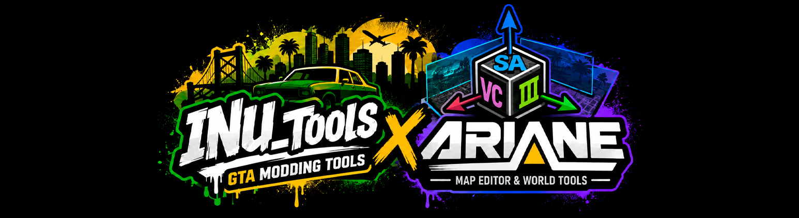

<div align="center">



# INU_Tools (GTA SA)

**Blender-аддон для моддинга GTA San Andreas — полный пайплайн от моделинга до IMG-архива.**

<p>
  
  
  
</p>

**[🇬🇧 English version](../README.md)** · **[📖 Документация](DOCS_rus.md)** · **[⚖️ Сравнение с Kams / DragonFF](COMPARISON_rus.md)**

</div>

> [!IMPORTANT]
> **Два способа установки — выбирай по своим задачам:**
>
> 🟢 **[Последний релиз](../../../releases/latest)** — рекомендую большинству. Проверено перед публикацией, поведение предсказуемое.
>
> 🟡 **Ветка `main`** (на этой странице `Code → Download ZIP` или `git clone`) — свежие фиксы и фичи в разработке, ещё не попавшие в релиз. Могут быть баги, недопиленный функционал, breaking changes. Все правки с `main` рано или поздно попадают в следующий релиз. Если поймал баг здесь — пожалуйста укажи **«from main»** в issue, чтобы я понимал релизный это репорт или с разработки.

---

## ✨ Главное

<table>
<tr>
<td width="50%" valign="top">

- 🌉 **Живой мост с Ariane** — двусторонняя правка в реальном времени с редактором карт **Ariane**: импорт по клику, отправка моделей / позиций / инстансов обратно
- ⚡ **Производительность** — Import Map ~10×, Export to IMG ~5–15× (параллельный парсинг DFF + batch IMG writer)
- 🎨 **Нативные парсеры** — DFF / COL / TXD / IDE / IPL / IMG / IFP / FXP, без внешних зависимостей
- 🗺️ **Полный round-trip карты** — IMG → Blender → правка DFF + COL + TXD → IMG другой сборки
- 🎆 **Редактор `effects.fxp`** — 82 системы, живая симуляция частиц во viewport
- 🦴 **Skinned DFF + IFP** — импорт педов с 294+ ванильными анимациями
- 🆔 **ID Manager** — multi-preset, sync со сценой, FLA-расширение, детекция конфликтов
- 🌍 **Мульти-игра** — GTA III / VC / SA, авто-детект при импорте
- 🔥 **Запекание текстур** — per-model AO / Diffuse / Bevel / Shadow / Alpha, тень-декали, изоляция объекта
- 💡 **Прилайт и LightMap** — запекание от всех источников + HDRI в vertex colors / текстуры

</td>
<td width="50%" valign="top">


</td>
</tr>
</table>

## 🔮 В планах

### 💭 Идеи на будущее

Не всё обязательно дойдёт до релиза — какие-то фичи могут отвалиться при ближайшем рассмотрении (нет смысла / нет приоритета / технически непрактично).

- 💾 **Game Folder Backup** — авто-снапшот `gta3.img` и важных `.ide` перед destructive ops (Map Export, IMG rebuild)
- 🔁 **IPL Mass Replace** — заменить все INST с model X на model Y по координатам / радиусу / тегу
- 🎆 **Auto-LOD generation** — при отсутствии парного `_L0` Map Export генерит decimate-копию автоматически (по примеру EMAPTool)

## 🆕 Что нового в 2.3.0

Самый крупный релиз — во главе **живой мост с редактором карт Ariane**.

- 🌉 **Мост с Ariane** — двусторонний живой мост с внешним редактором карт **Ariane** через общую папку: Ariane кидает выбранные модели прямо в открытый Blender (авто-расстановка + теги IDE/IPL), а ты отправляешь модели / позиции / новые инстансы обратно — с живой синхронизацией позиций, выделения и удалений
- 🌿 **Растительность / трава** — импорт/экспорт травы, генерация геометрии, превью, применение к выделенным полигонам, встроенный редактор **plants.dat**
- 🌐 **Зоны** — импорт/экспорт `map.zon` / `info.zon` как редактируемые боксы (один файл = одна коллекция)
- 📷 **Камеры** — импорт/экспорт camera `.dat` (позиции + FOV как keyframes)
- 🧩 **Фрагменты** — разбивка меша на breakable-фрагменты одной кнопкой (сетка / разброс)
- ✋ **Жесты рук** — авторинг жестов для `ghands.ifp`
- 🗂️ **Переработка IDE / IPL / IMG** — три вкладки **Импорт / Экспорт / Карта**; бокс **«Выделенная модель»** со статусом по файлам + Check / Add / Export / убрать; тумблеры **LOD / 2DFX / TXD / COL** инвертированы (ВКЛ = грузить); удаление инстанса IPL сносит парный LOD и пересчитывает индексы
- 📦 **Диалог «Экспорт в IMG»** — иерархия по модели **DFF → LOD / COL** с галочками; нет LOD → пишется основная модель как LOD, нет COL → пустая габаритная заглушка; **выбор IMG-архива**; **«Пересобрать после экспорта»**
- 🔥 **Запекание текстур** — **стек слоёв у каждой модели свой**; **«Изолировать объект»** (чинит чёрный AO среди объектов карты + ускоряет бейк); **карта Alpha** (RGBA), **Декаль** (прозрачная тень-декаль), **«Свет от сцены»** для Shadow/Diffuse-Lit, **Bevel по выделенным рёбрам**
- 💡 **Прилайт — все типы ламп + HDRI** — запекание от **Point / Sun / Spot / Area** плюс окружение **World / HDRI**, а не только точечные лампы
- 🎨 **Alpha-материалы** — сканирование, выделение и массовое применение прозрачных материалов (единый стандарт, фикс Blender 4.2+/EEVEE Next)
- 🗺️ **Импорт: ваниль vs кастом** — галочка **«Стандартная модель GTA SA (vanilla)»**; ВЫКЛ = кастом (связать геометрию, сохранить двусторонние заборы)
- 🚗 **Машины / DFF round-trip** — editable-импорт сохраняет нормали; реэкспорт **делит по нормали**; **замена текстуры экспортируется**; экспорт одиночной машины с зашитой коллизией
- 💡 **2DFX** — новые типы с превью: **Дорожный знак**, **Вход/Выход**, **Эскалатор**, плюс **Raw** (passthrough неизвестных эффектов)
- 🎬 **Анимации (IFP)** — **зеркало L/R** с учётом rest-позы; байт-точный round-trip + фиксы дёрганья; подпанель **«Иерархия фреймов»** со сменой родителя в дереве
- 🌊 **Вода** — оверлей «Лимиты воды» + привязка к блоку; **«Порезать по блокам (500)»** ещё и раскидывает куски по объектам
- 🧱 **Коллизии** — импорт в отдельную коллекцию, **цвета поверхностей во вьюпорте**, дамми-фреймы кубиками
- ⚡ **Производительность** — мемоизация отрисовки панелей (`draw_cache`), убирает лаги вьюпорта на больших картах
- 🌐 **Полная локализация EN + ES** — переведён весь интерфейс (включая тултипы операторов); русский не проступает в английском/испанском Blender

→ [Release notes 2.3.0](https://github.com/INU-ez/INU_Tools-GTA-sa-/releases/tag/v2.3.0) · [2.2.0](https://github.com/INU-ez/INU_Tools-GTA-sa-/releases/tag/v2.2.0) · [2.1.0](https://github.com/INU-ez/INU_Tools-GTA-sa-/releases/tag/v2.1.0) · [История версий](../../../releases)

## 🧰 Возможности

### Поддержка форматов

| Формат | Импорт | Экспорт | Правка | Что это |
|---|:---:|:---:|:---:|---|
| **DFF** | ✅ | ✅ | ✅ | 3D-модель RenderWare (геометрия, скиннинг, материалы, 2DFX, флаги) |
| **COL** | ✅ | ✅ | ✅ | Коллизия (COL3, 179 surface types) |
| **TXD** | ✅ | ✅ | ✅ | Текстуры (DXT1/DXT5, параллельно, pure numpy, drag&drop) |
| **IDE** | ✅ | ✅ | ✅ | Определения объектов (objs/tobj/anim/cars/peds/weap/hier/txdp) |
| **IPL** | ✅ | ✅ | ✅ | Размещение объектов (текстовый + binary, 11 секций, FLA) |
| **IMG** | ✅ | ✅ | ✅ | Архив ресурсов (VER2) — DFF + LOD + COL + TXD |
| **IFP** | ✅ | ✅ | ✅ | Анимации (294+ ванильных, batch import, ANP3/ANPK/ANP2) |
| **FXP** (`effects.fxp`) | ✅ | ✅ | ✅ | Частицы — 82 системы, viewport-симуляция, 40+ параметров |
| **CST** | ✅ | ✅ | ✅ | Текстовый формат Steve's COL Editor |
| **water.dat** | ✅ | ✅ | ✅ | Вода: типы, snap, текстура waterclear256 |
| **paths.ipl** / **tracks.dat** / **nodes*.dat** / **flight.dat** | ✅ | ✅ | ✅ | Пути машин/педов, ж/д, скомпилированные path nodes, маршруты полётов |

### Что ещё умеет

- 🗺️ **Полный Map round-trip** — импорт всей карты прямо из игровой папки (IDE + IPL + IMG → Blender), правка, Map Export обратно с сохранением лейаута
- 🆔 **ID Manager** — файл, multi-preset, sync со сценой, загрузка из игры, FLA-расширение, детекция конфликтов
- 💡 **Запекание Prelight** — Day/Night vcols, raycast-тени, scatter, листва, **Резак света** (лужи света под фонарями), заливка, превью вертекс-альфы, LightMap UV2, Modulate Color preview
- 🎯 **2DFX** — Light / Particle / Ped Attractor / Sun Glare с пресетами и attach/detach
- 🎨 **Материалы** — Env Map, Bump, Specular, Reflection, UV Animation, Dual Texture, COL Surface
- 🦴 **Skinned DFF + IK Rig** — арматура, веса, FK→IK bake для педов, **Frame Hierarchy Editor** с vanilla VEHICLE/PED шаблонами, byte-perfect round-trip
- 🎬 **Animated Map Object** — мастер одной кнопкой собирает DFF + IFP + IDE для анимированных объектов (мельницы, краны, двери)
- 🚗 **Vehicle Paintjob** — поддержка альт-текстур Pay'n'Spray (`<base>_paintjob1/2`) с валидацией парности
- ✅ **Validate Scene** — единый pre-export проход (кватернионы, флаги, парность damage/paintjob)
- 🔍 **File Scanner** — линт DFF/COL/TXD из папки на crash-prone паттерны (превышение лимитов, битые refs)
- 🗺️ **X Radar Maker** — генерация тайлов миникарты (8×8 / меню / полный радар) с упаковкой в TXD
- 🧩 **Profile System** — кастомные раскладки N-sidebar (видимость / порядок панелей) в JSON, переключение между задачами
- 🔍 **Авто-детект типа модели** — DFF / LOD / COL определяются автоматически (LOD по токену «lod» без учёта регистра, COL по тегу/отсутствию текстур); суффиксы `_DFF/_LOD/_COL` работают как ручной override
- 📁 **Папка пресетов** — направить все пресеты/данные (профили, пресеты ID, дефолты флагов пайплайна) в любую папку; при смене существующие пресеты копируются

## 🧭 Панели UI

| Расположение | Панель | Что там |
|---|---|---|
| `Properties > Scene` | **INU Tools** | IDE/IPL/IMG пути, текстуры, файлы IMG, папка пресетов |
| `Properties > Object` | **INU Tools: Model** | Тип (auto+manual), Model ID, TXD, Draw Dist, IDE Flags, DFF Flags, Pipeline, Breakable, 2DFX |
| `Properties > Material` | **GTA Material** (3 вкладки) | SURFACE — тип поверхности коллизии · ALPHA — прозрачные / alpha-материалы (единый стандарт прозрачности) · EFFECTS — Env Map, Bump, Reflection, Specular, UV Animation + быстрые пресеты (Стекло/Хром/Краска/Сброс) |
| `View3D > Sidebar (N)` | **GTA Tools** | пайплайн SETUP → MODEL → DATA → EXPORT (Export сверху, ID Manager, Object IDE/IPL, все остальные подпанели) |
| `View3D > Sidebar (N)` | **GTA Library** | Сборка Asset Library — «Извлечь ресурсы» → папка библиотеки → перегенерация превью |
| `UV Editor > Sidebar (N)` | **GTA Tools** | UV-инструменты |

## ⌨️ Горячие клавиши

| Клавиша | Действие |
|---|---|
| `Shift+T` | Открыть / закрыть UV Editor |

## 📹 Видеоурок

→ [Экспорт и импорт IDE / IPL / IMG / Map](https://www.youtube.com/watch?v=Jw_R9QFYxWE)

## 📦 Установка

**Blender Extensions (Blender 4.2+):** ставь с [extensions.blender.org](https://extensions.blender.org) (Get Extensions → найди "INU Tools"), либо **Edit → Preferences → Get Extensions → Install from Disk…** с релизным `.zip`.

**Вручную (Blender 2.83+):**
1. Скачай папку `INU_tools/` (или zip-архив)
2. Скопируй её в директорию аддонов Blender:
   ```
   Blender/<version>/scripts/addons/INU_tools/
   ```
3. Открой Blender → **Edit → Preferences → Add-ons** → включи **INU_tools(gta_sa)**

## 🔧 Совместимость

| | |
|---|---|
| **Blender** | 2.83 – 5.1 ✅ (4.2+ для установки через extensions.blender.org) |
| **Игра** | GTA San Andreas (основная), GTA Vice City + GTA III (экспериментально, см. ниже) |
| **MTA** | Совместим с MTA:SA (форк GTA SA) |
| **ОС** | Windows / Linux / macOS |

### 🎮 Мульти-игра (III / VC / SA)

INU Tools по умолчанию нацелен на **GTA San Andreas**, но умеет читать и писать более старые игры на RenderWare. Целевая игра задаётся дропдауном в шапке N-панели **GTA Tools** (SA / VC / III) — все экспортёры затем идут через нужный диспатч форматов.

| Формат | III (RW 3.3) | VC (RW 3.5) | SA (RW 3.6) |
|---|:-:|:-:|:-:|
| **DFF** чтение | ✅ авто-детект по RW-версии | ✅ авто-детект | ✅ |
| **DFF** запись | ✅ (без SA-only Night vcols, Pipeline-чанка, UV-аним) | ✅ (без Night vcols, Pipeline) | ✅ |
| **COL** чтение | ✅ `COLL` | ✅ `COL2` | ✅ `COL3` |
| **COL** запись | ✅ `COLL` v1 | ✅ `COL2` v2 | ✅ `COL3` v3 |
| **TXD** чтение | ✅ | ✅ | ✅ |
| **TXD** запись | ✅ (RW lib_id под игру) | ✅ | ✅ |
| **IDE** чтение | ✅ | ✅ | ✅ |
| **IDE** запись | ✅ (5 полей OBJS, без `txdp` / `2dfx`) | ✅ (5 полей OBJS, без `2dfx`) | ✅ (multi-mesh, `txdp`, `2dfx`) |
| **IPL** чтение | ✅ (12 колонок, scale, без interior) | ✅ (13 колонок, scale + interior) | ✅ (11 колонок, lod_index) |
| **IPL** запись | ✅ только текст | ✅ только текст | ✅ текст + binary |
| **IMG** чтение | ✅ VER1 (раздельные `.dir` + `.img`) | ✅ VER1 | ✅ VER2 |
| **IMG** запись | ✅ VER1 | ✅ VER1 | ✅ VER2 |
| **IFP** анимации | ✅ ANPK (chunked) | ✅ ANPK | ✅ ANPK + ANP3 compressed |
| **2DFX** | Light + Particle | + PedAttractor | + SunGlare |
| **Surface ID** | 0–84 (клампинг при записи) | 0–85 | 0–178 |

**Известные ограничения:**
- **Потери при трансляции поверхностей** — кросс-игровой COL-экспорт схлопывает ~12 категорий из 179 поверхностей SA. SA → VC → SA теряет под-типы (например `GRASS_SHORT` ↔ `GRASS_LONG`).
- **Кросс-игровые проверки Validate Scene** — предупреждают, если сцена нацелена на III/VC, а объекты всё ещё несут SA-only фичи (Night vcols, Multi-mesh LOD, UV-аним, SunGlare 2DFX).
- **Пайплайн редактора карт** — основной пайплайн — SA. Моддеры III/VC могут импортировать ванильные ассеты и экспортировать отдельные DFF/COL/TXD; полный round-trip карты пока только для SA.
- **IFP**: ANP3 (сжатый int16) — только SA; экспорт в III/VC авто-даунгрейдится в ANPK с предупреждением.

Активная игра сцены также влияет на пороги File Scanner / Map Analyzer — `model_id_max` (III=6500, VC=8500, SA=19999) и `surface_id_max` проверяются против лимитов целевой игры.

## 🙏 Благодарности

Вдохновлено и частично совместимо с:

- **[DragonFF](https://github.com/Parik27/DragonFF)** (Parik, GPL-3.0) — Blender-аддон для форматов RenderWare. INU_tools использует совместимые имена свойств материалов и объектов для удобного перехода между аддонами.
- **[RenderWare](https://en.wikipedia.org/wiki/RenderWare)** — игровой движок GTA SA, документация форматов DFF/COL/TXD.

### 🔧 Рекомендуемые сопутствующие инструменты

- **[Itera Tools 3](https://itera.gumroad.com/l/IteraTools3)** — Blender-аддон для vertex lighting. В INU_tools есть отдельная подпанель **Itera Tools 3** (внутри контейнера *Освещение*): авто-определяет Itera в Asset Libraries и применяет его пресеты `Vertex Lit Linear` / `Quickstart` к выделению (плюс `Убрать Itera` одной кнопкой — восстанавливает оригинальные материалы).

- **[Ariane](https://github.com/Dryxio/ariane)** — Ariane — это программа для просмотра и редактирования карт для Grand Theft Auto III, Vice City и San Andreas, созданная на основе librw и базирующаяся на euryopa от aap.

### Автор

**INU** — автор аддона (Discord: `1.n.u`)
https://discord.gg/sqtGAVTGdy

### Авторы фич

**yeezyk** — автор отзеркаливания анимаций

### Лицензия

[GPL-3.0](LICENSE)
